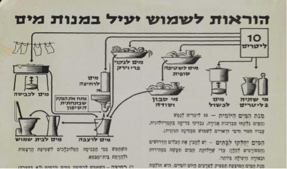

במהלך המצור על ירושלים בימי מלחמת העצמאות הונהג קיצוב חמור על אספקת המים לתושבים בשלב הראשון הוקצו 7.5 ליטרים ולאחר שנכבשו שכונות ערביות רבות עם בורות המים שבהם הקיצוב עלה ל-10 ליטרים לאדם ליום.
ביטוי למצוקת המים בזמן המצור נתן המשורר דן אלמגור בשירו "כוס אחת של מים":

הייתה לי כוס אחת של מים,

היה זה במצור בעיר ירושלים. 

לגמתי מן הכוס טיפה אחת או שתיים 

(...) 

צחצחתי את שיניי ובשארית המים 

כיבסתי מכנסיי פעם בחודשיים 

(...) 

את הסמרטוט הלח סחטתי בידיים, 

השקיתי בעציץ שושן אחד אפילו שניים, 

היה זה במצור בעיר ירושלים."

