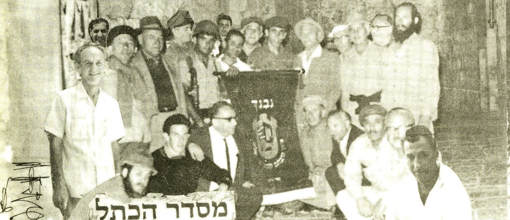

ב-8 ביוני, תוך כדי הלחימה, כאשר הגיעו חיילי צה"ל לכותל, כבר החלו הפעולות לנצל את תנופת הניצחון ולקבוע עובדות בשטח כדי להכין את האתר לקראת עצרת עם גדולה בחג השבועות הקרב. ראש העיר, טדי קולק, ואל"מ שלמה להט (צ'יץ) סברו שבגלל הרגישויות הפוליטיות של המעשה יש להטיל את משימת הריסת שכונת המוגרבים והכשרת רחבה על גוף אזרחי. חמישה עשר מוותיקי הקבלנים בירושלים נרתמו למבצע והגיעו במוצאי שבת, 10 ביוני, לסמטת הכותל. 

״בהתחשב עם קדושת השבת, עם צאת השבת קבלתי פקודה להתחיל בפינוי הרחבה בנוכחותם של ראש העיר, סגניו, מהנדס העיר וקבוצת הקבלנים. מר ז. פרוסק נתכבד בברכת הבדלה כאשר הנוכחים לא יכלו להסתיר את התרגשותם ודמעות שמחה הרטיבו את פניהם ואחרי זאת החלו הפטישים להלום תוך שירה והתרוממות הנפש.„ (מכתב של איתן בן-משה למהנדס לוי דובקין, 1971, אלבום איתן בן-משה)

המשתתפים התכנסו לפנות בוקר לתמונה קבוצתית על רקע הכותל. ברוך ברקאי, הכריז על הקמת 'מסדר הכותל' שעם חבריו נמנו חמישה עשר הקבלנים המתנדבים. הם ראו את עצמם כ'מטהרי המקדש' והמשיכו להיפגש עוד עשרות שנים.

