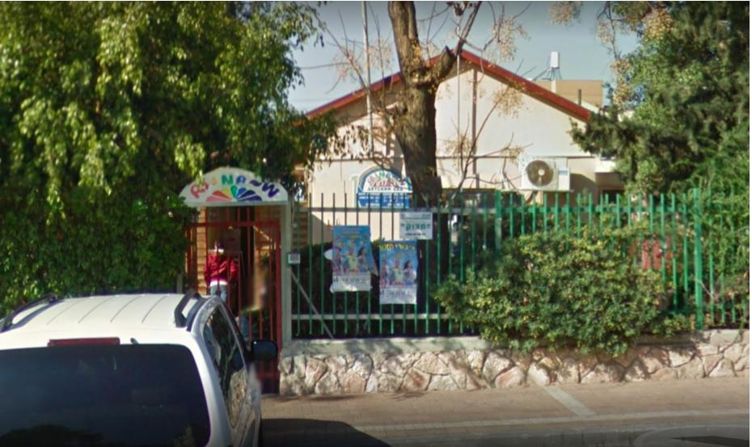

נתניה היא העיר השביעית בגודלה בישראל מבחינת מספר התושבים. ברחוב ירמיהו הקרוי על שם נביא החורבן ניתן למצוא את גן הילדים הרוסי ריינבו שכצפוי משמו מכיל את שבעת צבעי הקשת. בדגל של הרצליה אפשר למצוא שבעה כוכבים אבל היא העיר ה-18 בגודלה לפי מספר התושבים ורחוב ירמיהו שבה קרוי על שם ירמיהו הַלפֶּרן שהיה איש בית"ר והתנועה הרוויזיוניסטית, ממייסדי הימאות העברית.

