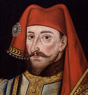
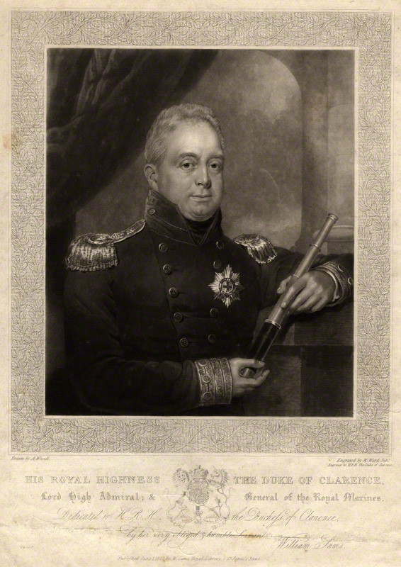
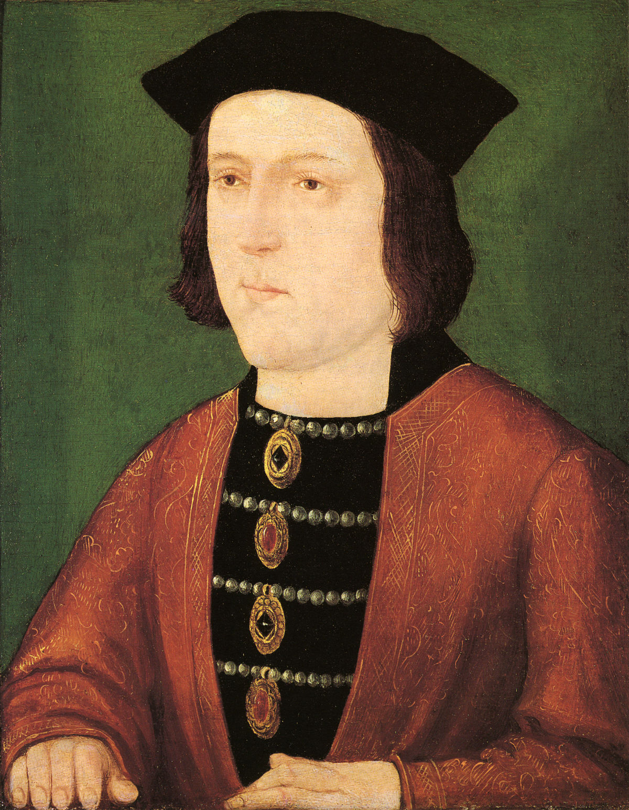
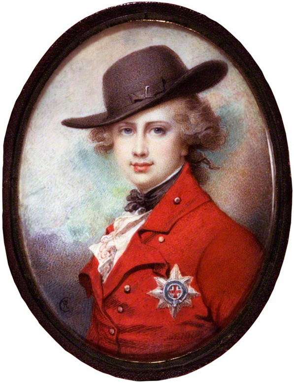
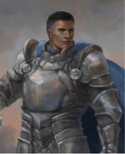

בימים הראשונים של מלחמת יום הכיפורים המצב הצבאי של מדינת ישראל היה נראה נואש, עד כדי כך ששר הביטחון משה דיין חשב שאנחנו על סף חורבן בית שלישי. כמובן שמשה דיין טעה, כיוון שבעיות עם בניין הבית השלישי היו כבר מאות שנים לפניו. באותו תאריך (לועזי) בו נפטר הפטרון של בית המקדש השלישי נפטר גם אחד ממלכי אנגליה. 

מי הוא המלך הזה?

