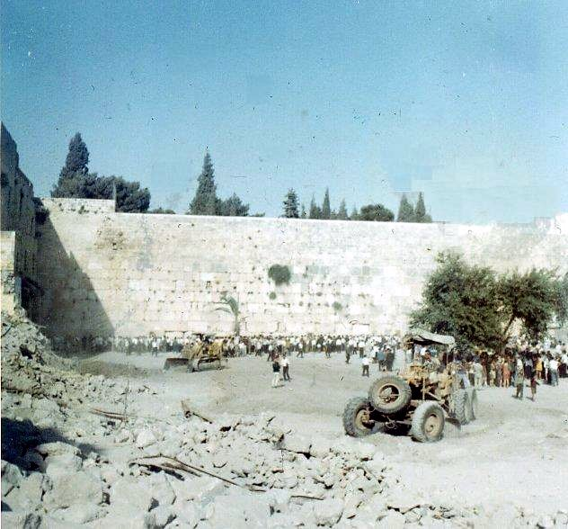

במלחמת ששת הימים נכבשה העיר העתיקה של ירושלים והדרך אל הכותל המערבי נפתחה. אבל רחבת הכותל ההיסטורית היתה צרה ודחוקה. לשם הרחבת הרחבה היה צורך להחריב את השכונה המערבית שעמדה לידו. 

איך כונו לימים אלו שהופקדו על המשימה?

* מסדר הכותל
* מכסחי המוגרבים
* גדוד אסף של חיל ההנדסה הקרבית
* גדוד ההנדסה של פיקוד מרכז
* "הקבלן" - יצחק עבוד הלוי
* שומרי משמרת הקודש
* מטהרי המקדש

