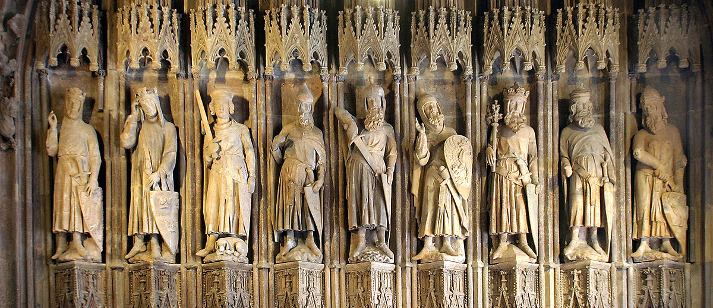

בתמונה מופיעות תשע דמויות. רוב הדמויות הללו נלחמו בירושלים או שלטו עליה. רק שלוש מהדמויות שבתמונה <strong>לא</strong> קשורות לירושלים. 

מי אלו?

- [ ]   הקטור
- [ ]  אכילס
- [ ]  אלכסנדר הגדול
- [ ]  יוליוס קיסר
- [ ]  יהושע בן נון
- [ ]  דוד
- [ ]  שלמה המלך
- [ ]  יהודה המכבי
- [ ]  קרל הגדול 
- [ ]  המלך ארתור
- [ ]  גוטפריד מבויון
- [ ]  ריצ'רד לב הארי